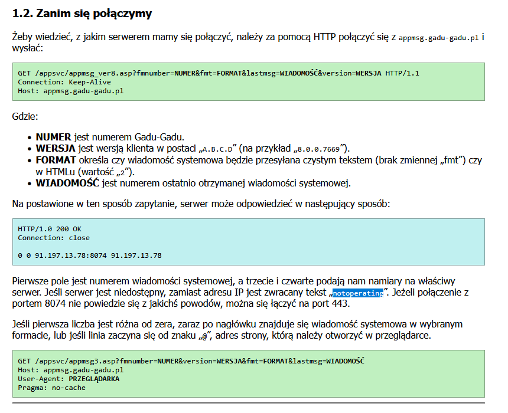

# klienty GG 5.0 i ich problem z łączeniem - z dnia 20.03.2026
Patrząc na rejestr w `HKCU/Software/Gadu-Gadu/Gadu-Gadu/Messenger` są wartości namiaru do serwera:
```
STRING ServerHost		->	0
STRING ServerHost443	->	192.168.137.1:443
DWORD  ServerPort		->	0x00001f8a (8074)
```

czasami klient zmienia, czasami nie - jak klient nie może się połączyć, najlepiej zmienić adresy na podane poniżej, nawet jeśli klient jest odpalony; lub zmienić podanie w `src/http/appsvc.c`
```
[regedit - HKCU/Software/Gadu-Gadu/Gadu-Gadu/Messenger]
STRING ServerHost		->	192.168.137.1 (czyli HOST)
STRING ServerHost443	->	192.168.137.1 (znowu HOST lub 0)
DWORD  ServerPort		->	0x00001f8a (8074 - jak było)
```

```c
// [src/http/appsvc.c @ 65-67]

    char body[64];
    snprintf(body, sizeof(body), "0 0 %s %s\n", HOST, HOST);		
	// powinno być:			0 0 192.168.137.1 192.168.137.1
	// a klient intepretuje adres jako ServerHost443

```
Początkowo klient sam znajdował adres, i dlatego w poprzedniej wersji było `192.168.137.1:8074` dla `ServerHost443`, port 443 jest szyfrowany przez SSL (według wiresharka, tak się dzieje) więc dlatego dane nie mogły dojść do klientów - wszystkie dan były wysyłane/obierane w plaintext przez nasz serwer, a klient wysyłał szyfrowane dane przez SSL - stąd nie doszło do komunikacji wcześniej.

Choć w dokumentacji libgadu (patrz [src/docs/SOURCES.md](https://github.com/Jakkret/OpenGaduServer/blob/main/docs/SOURCES.md)) możemy nadać jednemu z adresów `notoperating`:



jeszcze nie sprawdzone, ale pewnie jutro pobawię się tym dalej
*(EDIT 21.03.2026: sprawdzałem i nie działa.. ciekawe czemu)*